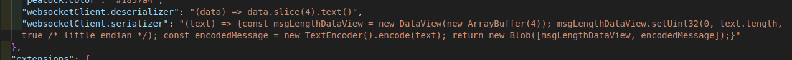

# WebSocket Chat

Fork of MoNouri97's [WebSocket Client](https://github.com/MoNouri97/vscode-websocket-client) with UI improvements and a way of specifying a custom de/serializer.

A simple WebSocket Client that can be used for testing purposes , this also supports STOMP connections over SockJs (to be used with Spring-Boot for example)

This is my first extension and it was created to solve my testing needs so it's not feature rich and might be a little bit buggy but feel free to contribute or to open an issue

## Features

### Send and Receive Messages + Log

### Connecting with STOMP , SockJs

### Custom de/serialization

## Known Issues

none yet, but this is not thoroughly tested

---

with ♥ from Tunisia

**Enjoy**
