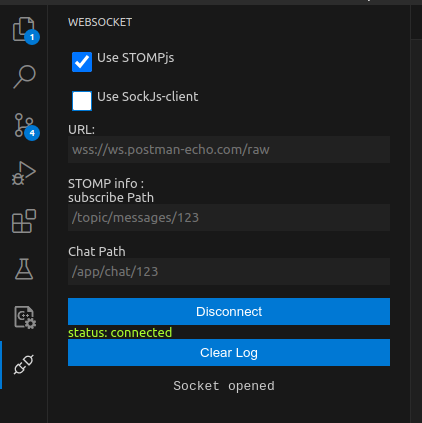
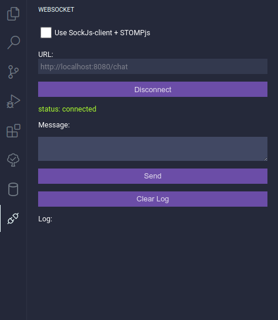
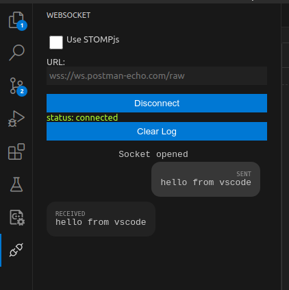

# WebSocket Client

A simple WebSocket Client that can be used for testing purposes , this also supports STOMP connections over SockJs (to be used with Spring-Boot for example)

This is my first extension and it was created to solve my testing needs so it's not feature rich and might be a little bit buggy but feel free to contribute or to open an issue

## Features

### Connecting with STOMP , SockJs

### Easy connecting

### Send and Receive Messages + Log

## Known Issues

none yet , but this is not thoroughly tested

## Release Notes

### 1.0.0

Initial release of WebSocket Client

---

with ♥ from Tunisia

**Enjoy**
